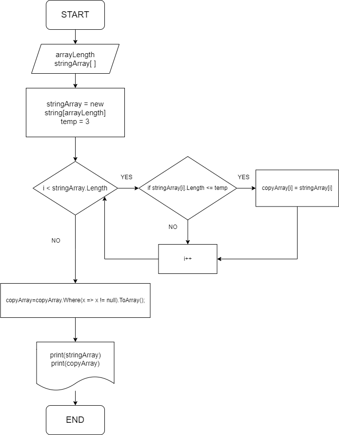

# Итоговая контрольная работа по основному блоку
## **Условия задачи**

Задача алгоритмически не самая сложная, однако для полноценного выполнения проверочной работы необходимо:

1. Создать репозиторий на __GitHub__
2. Нарисовать блок-схему алгоритма _(можно обойтись блок-схемой основной содержательной части, если вы выделяете её в отдельный метод)_
3. Снабдить репозиторий оформленным текстовым описанием решения _(файл __README.md__)_
4. Написать программу, решающую поставленную задачу
5. Использовать контроль версий в работе над этим небольшим проектом _(не должно быть так, что всё залито одним коммитом, как минимум этапы 2, 3, и 4 должны быть расположены в разных коммитах)_

**Задача:**

Написать программу, которая из имеющегося массива строк формирует новый массив из строк, длина которых меньше, либо равна 3 символам. Первоначальный массив можно ввести с клавиатуры, либо задать на старте выполнения алгоритма. При решении не рекомендуется пользоваться коллекциями, лучше обойтись исключительно массивами.

**Примеры:**

[“Hello”, “2”, “world”, “:-)”] → [“2”, “:-)”]

[“1234”, “1567”, “-2”, “computer science”] → [“-2”]

[“Russia”, “Denmark”, “Kazan”] → []

## **Решение**

1. Пользователь вводит дину массива и заполняет его символами.
2. Создаем 2-й массив, размер которого равен массиву пользователя.
3. Создаем новую переменную "temp = 3" 
4. С помощью цикла сравниваем каждый элемент в массиве пользователя и если он меньше или равен 3, то мы копируем этот элемент в массив №2.
5. Выводим оба массива на экран

## **Блок-схема решения**

> 

## **Скриншот коммитов**

> 